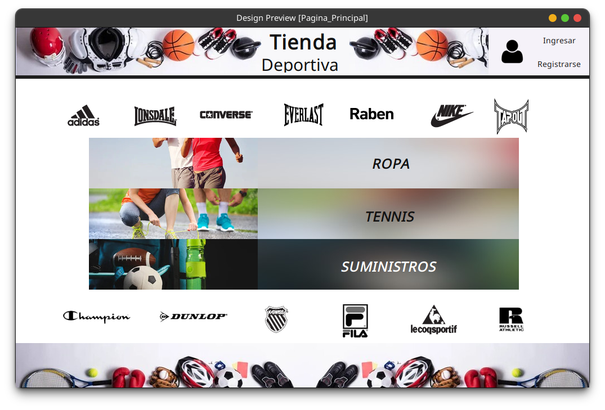

# Tienda de Artículos Deportivos

[](https://github.com/Nekstoreo/tienda-deportiva/blob/main/LICENSE)
[](https://www.oracle.com/java/technologies/downloads/#java17)

¡Bienvenido/a a la Tienda de Artículos Deportivos! Este proyecto es parte de mi clase de lógica de programación en la universidad y fue desarrollado por Nekstoreo, estudiante de ingeniería en sistemas e informática.

## Descripción

La Tienda de Artículos Deportivos es una aplicación diseñada con Java Swing Java que permite gestionar la información de una tienda virtual de artículos deportivos. 

## Características

- Interfaz de usuario intuitiva y fácil de usar.
- Administración de productos: agregar, eliminar y actualizar productos.
- Búsqueda de productos por categoría.
- Carrito de compras para agregar y eliminar productos.
- Generación de facturas de compra.

## Capturas de pantalla



## Instalación

1. Clona este repositorio en tu máquina local:

```shell
git clone https://github.com/Nekstoreo/Proyecto_Final_Logica.git
```
2. Navega a la carpeta del proyecto:

```shell
cd Proyecto_Final_Logica
```

## Contribución

¡Las contribuciones son bienvenidas! Si tienes ideas, sugerencias o encuentras algún error, por favor, abre un issue o envía una pull request.


    Posdata: Este Readme.md fue creado con la ayuda de chatGPT.